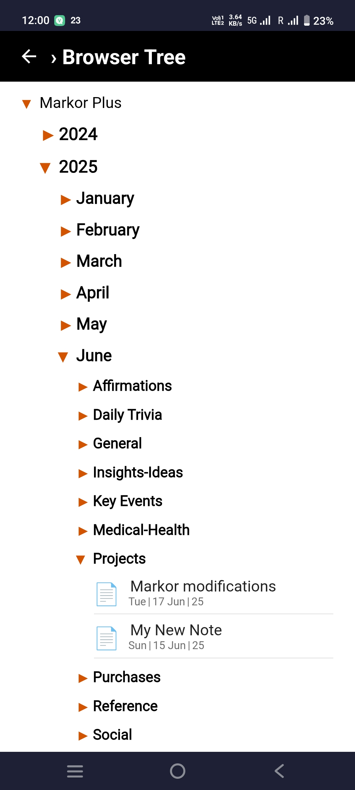
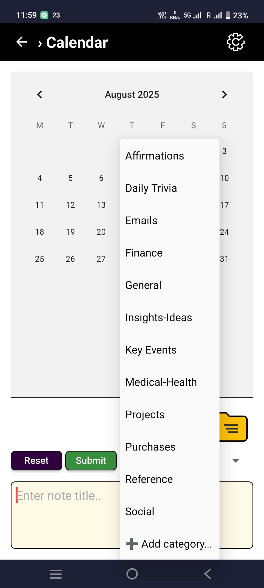
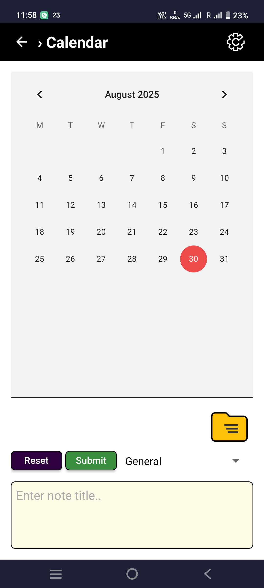
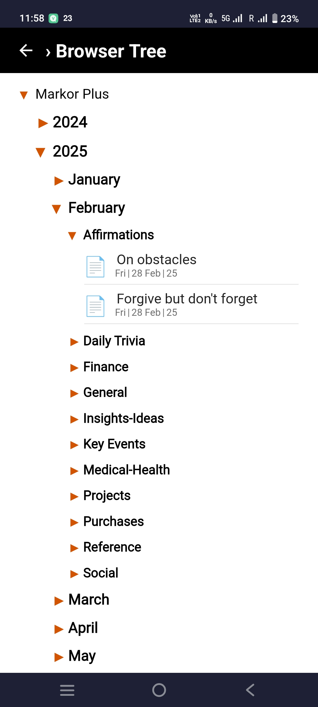
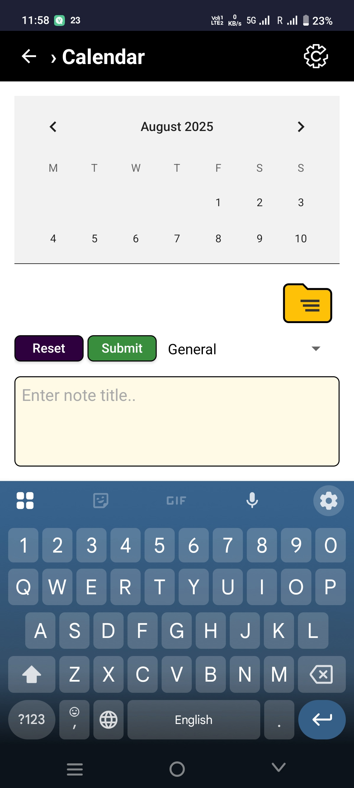

# Markor Plus (prototype)

 Markor Plus is an add-on for the open-source Markor note app that adds a **Yearly Journal Organizer**: a quick **Calendar Input** to create notes and a **Folder Tree** to browse notes by **Year → Month → Category → Note** with stable chronological context.

**Status:** early prototype. Expect rough edges. Feedback and PRs welcome.

## Why Markor Plus

Markor’s folders are powerful, but deep navigation can hide the sense of **time** that helps memory. Markor Plus focuses on **fast capture** and **timeline-style retrieval**:

* **Not** a planner/reminder.
* **Is** a memory/archiving helper: quickly log a titled note into the correct year/month/category, then browse it in a collapsible timeline.

Typical uses:

* Recalling **what happened when** across similar events (e.g., multiple trips or recurring tasks in a year).
* Light journaling where the **note title** often carries the essence (titles can be up to \~250 characters).

## Features

* **Calendar Input UI (via FAB)**
  Pick a **Category**, enter or dictate a **Note Title**, tap **Submit**. A new note opens with a **date-stamp at the top-left**; add body content or just back out if the title suffices. **Reset** clears the title and resets the date to **today**.
- **Folder Tree (WebView)**
  - Accordion navigation: **Year → Month → Category → Notes**.
  - Notes show their **title without file suffix**.
  - Sorted by **creation chronology** (stable “newest → oldest”), not by last modified time.
  - **Doc icon badges for long-title notes (>120 chars):** ○ hollow dot = **title-only** (no body); ● filled **red** dot = **has body content**.

* **Auto-creation of folders**
  Missing **Year/Month/Category** directories are created on submit.
* **Category management (prototype)**
  Add/delete categories in-app. (Rename/move/copy notes currently handled via Markor’s native file tools.)
* **Local-first & offline**
  Files live in device storage within a chosen **root directory**. No network needed.

## How it works (high level)

**On-disk layout**

```
/<Root>/
  YYYY/
    MM_MonthName/
      <Category>/
        <NoteTitle>.md
```

**Stable chronology**
A lightweight creation timestamp/index keeps lists in **creation order** even if files are later edited.

**Surfaces**
A **FAB** launches the Calendar Input screen; a **browser icon** opens the Folder Tree.

## Known limitations (prototype)

* **Rename/move/copy**: use Markor’s native browser for now.
* Very **large archives** can slow scanning; placing a `.nomedia` (or a custom `.skip-scan`) in heavy directories helps.
* Root paths may vary across devices; migration isn’t automated yet.
* Accessibility, internationalization, and small-screen polish are ongoing.
* **CalendarView quirk:** browsing to other months in the Folder Tree reflects correctly **only after a day is selected** in the calendar. This is a limitation of Android’s stock `CalendarView`.

## Roadmap / ideas

* Safe inline **rename/move** from Folder Tree (with undo).
* Richer **category editor** (ordering, icons, color).
* Search/filter within **year/month/category**.
* Export to **printable/interactive timeline PDF**.
* Tests to guarantee **creation-chronology** behavior.
* Performance: incremental scanning, caching, “open at current path” defaults.
* **Calendar upgrade:** evaluate more customizable third-party calendars (e.g., MaterialCalendarView, Kizitonwose) to replace/augment `CalendarView` and remove the “select a day” quirk.
* **Year Overview** module with grid layout (see standalone HTML version)
  

## Building / running (for collaborators)

Lives as an **add-on module inside a Markor fork**.

* **Prerequisites:** Android Studio and a recent Android SDK.
* **Integration:** include the module in a Markor project or use a branch where it’s already wired.
* **Run:** launch a flavor that exposes the Calendar Input and Folder Tree surfaces.

## Contributing

Open issues with repro steps, screenshots, device/Android version, and Markor build/flavor.
PRs: keep changes small and focused; include rationale, risks, and UI before/after when applicable.

## Privacy & permissions

Notes are plain files in local storage. No analytics or tracking. Permissions are limited to what Markor needs to read/write files.

## Screenshots








## License

TBD (likely **Apache-2.0** to align with Markor; confirm before first public release).

## Acknowledgments

Built on the excellent Markor project and community. Thanks to Harshad Vedartham harshad1 for HTML applet inspiration. 


